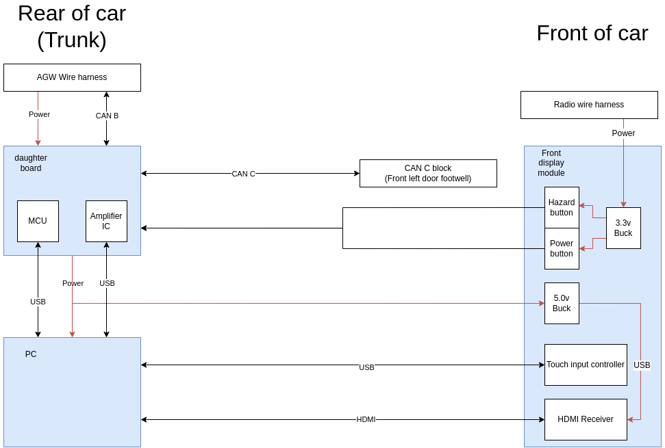

# MB W211 PC
A fully custom infotainment system for my W211 E55 AMG based on a PC with a custom daughter board!

## [Youtube playlist](https://www.youtube.com/playlist?list=PLxrw-4Vt7xtssJNuhHKJYzeYu5KKqYpgG)

**PROCEED AT YOUR OWN RISK!**
This project is for advanced users only as a lot of the code (Specifically the MCU code) has to be designed from scratch due to licensing issues.

**THIS WILL ONLY WORK IF YOU HAVE AGW**. Cars that just have the Radio module, and no AudioGateway module in the trunk will not be compatible with this project!

# Requirements

## Hardware
Hookup guide and general block diagram:


### Touch input controller
The touch input controller is based on an Arduino Micro and GT911 driven touch display. You can find the code for it under the `touch_sw` folder.

### Daughter board

**Check the schematics directory of this project for the Gerber and schematics of the daughter PCB!**

The daughter board is powered by the SAME51J20A MCU, on the [Microchip Curiosity nano (EV76S68A)](https://www.microchip.com/en-us/development-tool/EV76S68A). Due to licensing issues with the MPLABX SDK, I cannot publish some code for this project, so below there is a guide on how to adapt your own code base to talk to the PC.

* [SAME51J20A Data sheet](https://www.microchip.com/en-us/product/ATSAME51J20A#document-table)

Below is a hookup table showing the IO of the PCB

|CPU PIN|CPU PORT|Function|Description|
|:-:|:-:|:-:|:-:|
|12|PortB|CAN C Tx||
|13|PortB|CAN C Rx||
|12|PortA|CAN C shdn|When set to high, the CAN C transceiver will shut down to save some power when the MCU goes to sleep when the car is off|
|22|PortA|CAN B Tx||
|23|PortB|CAN B Rx||
|27|PortA|AMP Standby|When high, standby is disabled, when low, standby is enabled. Check the TDA IC datasheets for how standby works|
|05|PortA|AMP Mute|When high, the Amplifier can output sound. When low, the amplifier is muted. Check the TDA IC datasheets for how mute works|
|01|PortB|Front panel power btn|Trigger on voltage change|
|00|PortB|Front panel hazards btn|Trigger on voltage change|
|07|PortB|PC Power button|Allows the MCU to turn the PC on by emulating the power button press of the PC|
|06|PortB|PC Reset button|Allows the MCU to force reset the PC on by emulating the reset button press of the PC|
|04|PortB|Amplifier power MOSFET|Allows toggling power to the whole amplifier circuity on the PCB|
|05|PortB|PC power MOSFET|Allows toggling power to the PC and front display|
|07|PortA|ADC Voltage sense|Allows for monitoring the supply voltage to the board|
|04|PortA|ADC INA input PC|Current measuring of the PC circuitry|
|09|PortA|ADC INA input AMP|Current measuring of the amplifier circuitry|


### PC
**NOTE**. The PC should be designed to NEVER draw more than 250W!. Doing so could blow the AGW fuse and overload the stock wiring harness.

* Pico PSU that can handle 6-35V (Automotive safe). 

## Making the MCU talk to the PC
The MCU and PC talk to one another over an emulated CAN network that runs over a USB cable. 

The format of this protocol is very simple, and runs at a 115200 baud rate:

### MCU to PC
The MCU sends an ASCII encoded string to the PC for every CAN frame:
```
[BUS TAG][ID (Hex)] [DATA]\n
``` 
Example:
```
C000C 0011223344\n
```
This would indicate a frame on bus `C` that has an ID of `0x000C`, and data of `[0x00, 0x11, 0x22, 0x33, 0x44]`

### PC to MCU
The PC sends byte packed structures to the MCU (This is faster for the MCU to decode rather than ASCII strings)
```c++
typedef struct {
  // Bus tag character
  char can_id;
  // CAN ID
  uint16_t id;
  // CAN DLC
  uint8_t dlc;
  // Data array
  uint8_t data[8];
}  __attribute__ ((packed)) PcFrame;
```

### Valid Bus tags
* **C** - Frame is to/from CAN C (powertrain CAN of W211)
* **B** - Frame is to/from CAN B (interior CAN of W211)
* **E** - Frame is a status frame that is transmitted to/from the PC and MCU for systems status. You can check [the DBC](can_e.dbc) for the formats of these frames.

