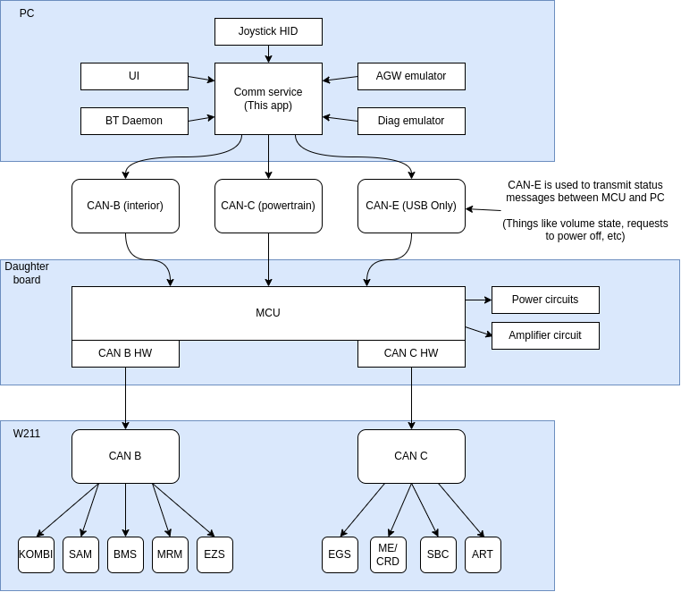

# W211 daughter board communication daemon

This project contains the following:

* AGW Emulation (Audio and NAVI pages)
* ISOTP communication wrapper

# Architecture




# AGW to KOMBI communication format

The AGW (Audio Gateway) module on the W211/W203 vehicles communicates over ISO-TP to the cluster. This allows the AGW module to tell the cluster what to display
on each page. 

## Standard protocol

### PKG descriptions
Each payload sent to the cluster has a 2 byte tag at the start of it. The first byte is the target page ID, the second byte is the PKG ID.

|PAGE ID|Page|
|:-:|:-:|
|03|Audio|
|04|Navi|
|05|Telephone|

After transmitting each package, the receiving ECU must acknowledge the package. This is done by transmitting a 3 byte package that contains
the Page ID, PKG ID, and ACK Flag. The status of the ACK Flag can be seen below:

|ACK Flag|Desc|
|:-:|:-:|
|D9|??|
|06|OK|
|15|ERR|

```
AGW:   [03, 20, 02, 11, C3]
KOMBI: [03, 20, 06]
```
Here we see AGW sent package 20 for page 03, and KOMBI acknowledged the package (Status flag 06 OK). If the status flag was 0x15 (Error), then AGW would re-send the same package again.

Each package that is NOT an acknowledge packet must contain a checksum value at the final byte. The checksum calculation is done using the following C code:

```c++
uint8_t calc_checksum(uint8_t* buffer, usize buffer_len) {
    uint8_t res = 0xFF;
    for (int i = 0; i < buffer_len; i++) {
        res -= buffer[i];
        res -= i;
    }
    return res;
}
```

#### Init sequence of any page

The package 0x04 is a special package. It is only sent with the page ID of 0x04 (Even if the KOMBI module does not have the telephone page enabled), and tells the AGW module that the KOMBI module is awake and ready to start receiving packets.

|Sender|PKG|Desc|
|:-:|:-:|:-:|
|KOMBI|0x04|WAKE UP!|
|AGW|ACK 0x04|
|AGW|0x20||
|KOMBI|ACK 0x20||
|KOMBI|0x21||
|AGW|ACK 0x21||
|AGW|0x24|Page format and header|
|KOMBI|ACK 0x24||
|KOMBI|0x25||
|AGW|ACK 0x25||
|AGW|0x26|Body format and data|
|KOMBI|ACK 0x26||


For each package, each page has a slightly different way of interpreting the incoming data, so there is no fixed format as it is page dependent!

#### Package 20 (AGW to KOMBI)
```
[<PAGE>, 0x20, 0x02, 0x11, <CS>]
```

**Description**
|Byte|Desc|
|:-:|:-:|
|0|Page|
|1|Package 20|
|2|??|
|3|??|
|4|Checksum|

#### Package 21 (KOMBI to AGW)
```
[<PAGE>, 0x21, 0x02, 0x01, <CS>]
```
**Description**
|Byte|Desc|
|:-:|:-:|
|0|Page|
|1|Package 21|
|2|??|
|3|??|
|4|Checksum|


#### Package 24 (AGW to KOMBI)
AUDIO
```
[0x03, 0x24, 0x02, 0x60, 0x00, 0x01, 0x00, 0x00, 0x00, 0x13, <S1>, 0x01, <S2>, 0x02, 0x00, <TLEN>, <TFMT>, <TEXT...>, 0x00, <CS>]
```
TELEPHONE
```
[0x05, 0x24, 0x02, 0x60, 0x01, 0x04, 0x00, 0x00, 0x00, 0x15, <S1>, 0x01, <S2>, 0x02, <S3>, 0x03, <S4>, 0x04, 0x00, <TLEN>, <TFMT>, <TEXT...>, 0x00, <CS>]
```
NAVI
```
[0x04, 0x24, 0x03, 0x00, 0x01, 0x03, 0x00, 0x00, 0x00, 0x00, 0x00, 0x00, <CS>]
```

**Description**
|Byte|Desc|
|:-:|:-:|
|S1|Symbol image ID 1|
|S2|Symbol image ID 2|
|S3|Symbol image ID 3|
|S4|Symbol image ID 4|
|TLEN|Text length + 2|
|TFMT|Text format byte|
|TEXT...|Text string (Multiple bytes)|
|CS|Checksum|

**NOTES**

* Audio page only supports 2 symbols. Telephone page supports 4 symbols, but only 2 can be displayed at once?
* NAVI page has no header text. Instead, the 'heading' text is created using package 26 to describe the current and next road.


#### Package 26 (AGW to KOMBI)

NAVI
```
[0x04, 0x26, 0x01, 0x00, 0x03, <R1LEN>, 0x10, <R1...>, 0x00, <R2LEN>, 0x10, <R2...>, 0x00, <METALEN>, 0x80, <META...>, 0x00, <CS>]
```

**Description**
|Byte|Desc|
|:-:|:-:|
|R1...|NAVI ONLY! - Next road name|
|R2...|NAVI ONLY! - Current road name|
|META...|NAVI ONLY! - Metadata about symbol and countdown to next action|


### NAVI metadata field format
```
[<UNIT>, 0x00, 0x00, <BFILL>, <DISTANCE>, <SYMBOL META...>]
```

**Description**
|Byte|Desc|
|:-:|:-:|
|UNIT|Navigation unit to display|
|BFILL|Countdown bar fill (If present). 0x00 - Empty, 0xFF, full|
|DISTANCE|Distance to next action (If present). 0x00 - NOW, 0xFF - 150 `UNIT`|
|SYMBOL META|TBA, depending on the symbol to show on NAVI, this metadata changes length, and also dictates if the countdown bar and distance should be shown|